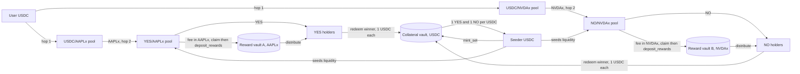
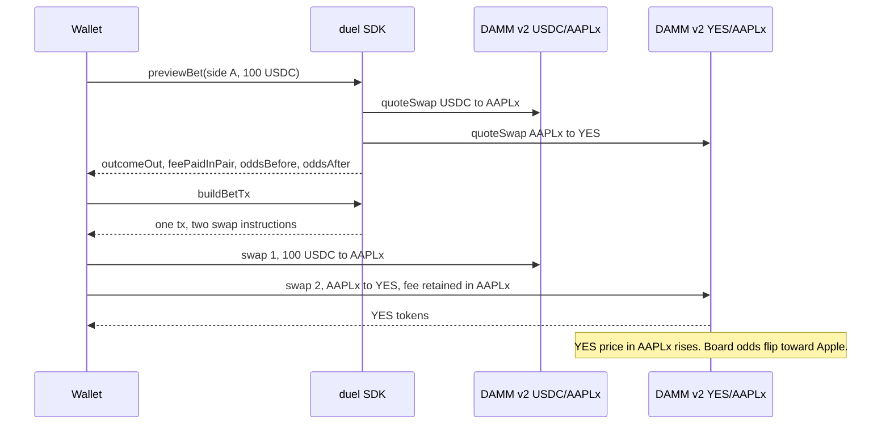
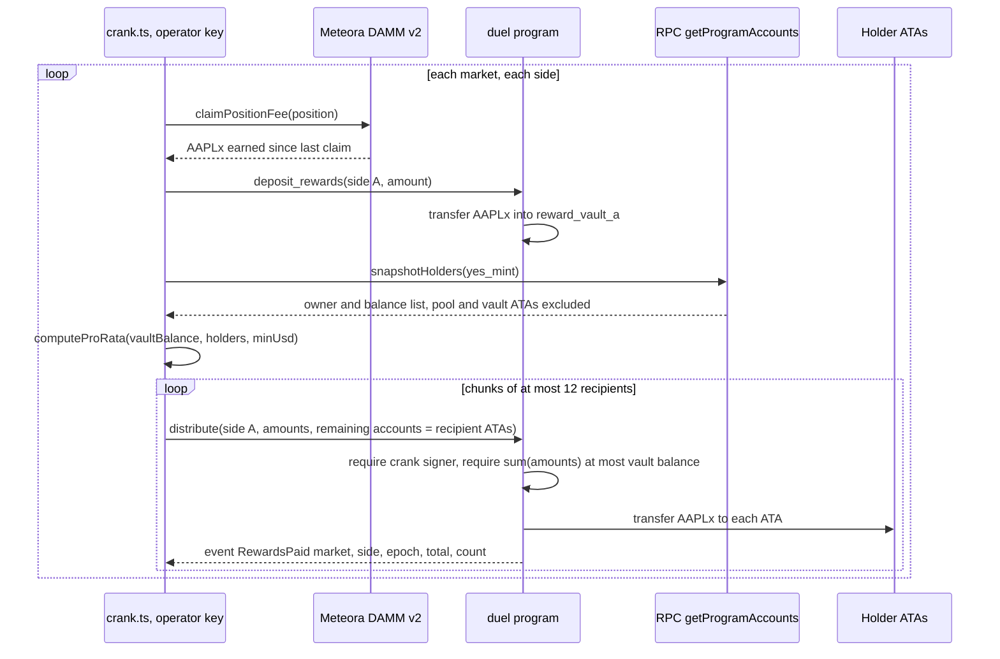
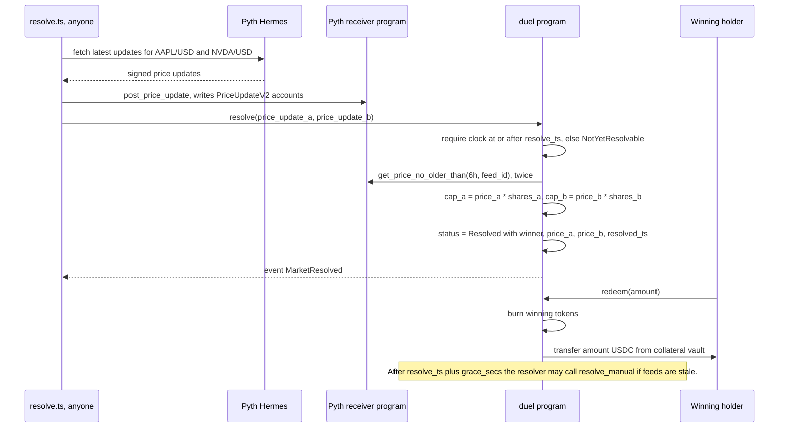

# Architecture: Paired Prediction Duels

One page for a technical judge. The on-chain footprint is one small Anchor 0.32 program named `duel`. Everything else is composition of live Solana infrastructure: Meteora DAMM v2 pools, Pyth equity feeds, and xStocks Token-2022 mints.

## 1. What a duel is

A duel is a head-to-head question with a hard resolution date. The flagship: "Will Apple be more valuable than Nvidia at the close on December 31, 2026?" It has two outcome tokens, YES and NO, 6 decimals each, minted by the market PDA.

- **Fully collateralized by USDC.** `mint_set(amount)` takes `amount` USDC into the collateral vault and mints `amount` YES and `amount` NO to the signer. `merge_set` is the exact reverse. At every moment YES supply equals NO supply equals USDC in the vault less redemptions, so one YES plus one NO is always worth one USDC.
- **YES trades against AAPLx, NO trades against NVDAx.** Each side has its own Meteora DAMM v2 pool: YES/AAPLx and NO/NVDAx. The stock token is the quote. The displayed probability is the YES price in AAPLx times the AAPLx price in USD, normalized against the NO side so the pair sums to 1 (`odds.ts`). The raw implied sum is shown too; when it drifts from 1 there is a mint-and-sell arbitrage through `mint_set`.
- **Fees are collected in the stock token and paid to that side's holders.** Both pools use DAMM v2's quote-only fee mode (100 bps in the devnet bootstrap). Apple-side fees accrue in AAPLx, Nvidia-side fees in NVDAx. A crank claims them, deposits them into the market's reward vault for that side, and pays them pro-rata to holders of that side's token. Betting on Apple earns Apple. Losing the bet does not claw back the Apple already paid.
- **Pyth resolution.** After `resolve_ts`, anyone can call `resolve()` with posted Pyth `PriceUpdateV2` accounts. The program reads `Equity.US.AAPL/USD` and `Equity.US.NVDA/USD` through `pyth-solana-receiver-sdk` with `get_price_no_older_than(max_age = 6h)`, a window that covers the last equity close, multiplies each price by the share count stored in the market, and sets the winner. No oracle publishes market cap, so share counts live in the market account and print on the duel page.
- **Redemption.** `redeem(amount)` burns winning tokens and pays `amount` USDC from the collateral vault. The losing token is worth zero. Whatever stock token it earned in fees stays with the holder.

Three templates ship: `CapCompare` (price_a × shares_a > price_b × shares_b), `RatioOutperform` (price_a / price_b at resolve > start ratio), and `PriceAbove` (one feed against a threshold). Anyone can create a duel from a template.

## 2. Money flow

Two things to notice. Collateral never touches the pools; the pools hold only outcome tokens and stock tokens. Rewards never touch collateral; they are stock tokens the pools earned as fees.

## 3. Sequence: place a bet (two-hop swap)

`routing.buildBetTx({ side, usdcAmount })` builds one transaction with two swap instructions. On mainnet the first hop uses an existing USDC/AAPLx pool; on devnet the bootstrap creates one at the Pyth price.

`buildSellTx` is the mirror: YES to AAPLx to USDC. Every trade on either pool pays its fee in the stock token, so buying and selling Apple both pay Apple holders.

## 4. Sequence: rewards crank

The ledger on the duel page is built from `RewardsPaid` events. Pool ATAs and the market's own vaults are excluded from the snapshot so fees are not paid back into the pool.

## 5. Sequence: resolution

## 6. Account model

`Market` is a PDA at `["market", creator, nonce_u64]`. It is the mint authority for YES and NO and the owner of the collateral vault and both reward vaults (all ATAs).

| Field | Type | Purpose |
|---|---|---|
| `creator`, `nonce`, `bump` | Pubkey, u64, u8 | PDA derivation |
| `question` | String, max 160 | The full sentence shown on the duel page |
| `side_a_label`, `side_b_label` | String, max 24 | "Apple", "Nvidia" |
| `collateral_mint`, `collateral_vault` | Pubkey | USDC (mock on devnet) and its vault ATA |
| `yes_mint`, `no_mint` | Pubkey | 6 decimals, mint authority = market PDA |
| `pair_a_mint`, `pair_b_mint` | Pubkey | AAPLx, NVDAx |
| `reward_vault_a`, `reward_vault_b` | Pubkey | ATAs of the pair mints owned by the PDA |
| `template` | enum | `CapCompare { feed_a, feed_b, shares_a, shares_b }`, `RatioOutperform { feed_a, feed_b, start_ratio_e9 }`, `PriceAbove { feed, threshold_e6 }` |
| `resolve_ts`, `grace_secs` | i64 | Earliest resolve time; manual fallback allowed after `resolve_ts + grace_secs` |
| `resolver`, `crank` | Pubkey | Manual-resolve authority; rewards distributor |
| `fee_bps_holders`, `fee_bps_creator`, `fee_bps_platform` | u16 | Declared split; the pool fee itself lives in Meteora |
| `status` | enum | `Open` or `Resolved { winner, price_a, price_b, resolved_ts }` |
| `pool_a`, `pool_b` | Pubkey | Meteora pool addresses, set once by `set_pools` |
| `total_minted`, `total_redeemed`, `rewards_paid_a`, `rewards_paid_b`, `epochs` | u64 ×4, u32 | Counters for the tale of the tape |

Instructions: `create_market`, `set_pools` (creator, once), `mint_set`, `merge_set`, `resolve` (permissionless after `resolve_ts`), `resolve_manual` (resolver, after grace), `redeem`, `deposit_rewards` (anyone), `distribute` (crank, max 12 recipients, `sum(amounts) <= vault`). Errors: `NotYetResolvable`, `AlreadyResolved`, `NotResolved`, `WrongSide`, `StaleOracle`, `GraceNotElapsed`, `Unauthorized`, `TooManyRecipients`, `InsufficientRewards`. Events: `MarketCreated`, `SetMinted`, `SetMerged`, `MarketResolved`, `Redeemed`, `RewardsPaid`.

## 7. Why Solana

The product is a composition of four things that are live on Solana today and do not co-exist on any other chain.

1. **Meteora DAMM v2 quote-only fees.** Program `cpamdpZCGKUy5JxQXB4dcpGPiikHawvSWAd6mEn1sGG`, client `@meteora-ag/cp-amm-sdk`. A pool can collect its fee in the quote token only, and permanently locked positions still earn fees. That one option is what lets an Apple bet pay out in Apple with no swap in the reward path. xStocks are already badged as quote tokens in DAMM v2 and DBC.
2. **Pyth equity feeds on Solana.** `Equity.US.AAPL/USD` (id `49f6b65c…`) and `Equity.US.NVDA/USD` (id `b1073854…`) on the 50 ms channel during market hours, push accounts on shard 1 (shard 0 has been stale since Aug 14, 2026), pull path through `pyth-solana-receiver-sdk` and Hermes, plus 24/7 synthetic `Equity.Index.AAPL/USD` and `Equity.Index.NVDA/USD` as fallback. Sept 25, 2026 prints: AAPL $340.35, NVDA $223.96.
3. **xStocks as Token-2022 on Solana.** Live since June 30, 2025, 60+ tickers (AAPLx, NVDAx, TSLAx, SPYx), secondary transfers unrestricted with no KYC for DEX trades. About 95% of global tokenized-equity DEX volume is on Solana, $5.8B in Q2 2026. The alternatives do not compose: Robinhood Chain's Stock Tokens are 18-decimal ERC-20 debt instruments on an Arbitrum Orbit L2 with no bridge to Solana beyond USDC; Ondo's Solana tokens carry an active transfer hook and trade by RFQ, not in AMM pools; Polymarket's outcome tokens are ERC-1155 on Polygon. No other chain has a permissionless tokenized stock next to a permissionless AMM with quote-only fees and an on-chain equity oracle.
4. **One small Anchor program.** Everything the program does is mint, burn, transfer, and read a Pyth account. The AMM, the oracle, and the stock issuer are not ours. That keeps the audit surface small and the product composable: the outcome tokens are plain SPL mints, the pools are plain DAMM v2 pools, and any wallet, aggregator, or launchpad can route into YES/AAPLx without asking us.

## 8. Trust assumptions today, and the upgrade path

| Today | Why | Upgrade |
|---|---|---|
| The operator wallet owns the Meteora LP positions and calls `claimPositionFee` | Shortest path to a working devnet demo | Move position ownership to a market-derived PDA and claim by CPI, or permanently lock the positions, which DAMM v2 keeps paying |
| Rewards accounting is off-chain: the crank snapshots holders with `getProgramAccounts`, computes pro-rata amounts, and calls `distribute` | The program enforces only the crank signer and `sum(amounts) <= vault` | On-chain time-weighted accumulator (balance × seconds, the StockLaunch pattern) or a merkle distributor (Jito or Saber) with published snapshots |
| `resolve_manual` by the `resolver` key after `resolve_ts + grace_secs` | Pyth equity feeds tick only in market hours; holidays and outages happen | Fallback ladder inside `resolve`: 24/7 `Equity.Index` feeds, then a Switchboard custom feed, then a timelocked override; the grace period is the public dispute window |
| Share counts are set at creation | No oracle publishes shares outstanding or market cap | Resolver-gated update before a freeze date, with the values printed on the duel page |
| `fee_bps_*` fields are declared, not enforced | The pool fee is configured in Meteora | Split creator and platform cuts on-chain inside `deposit_rewards` |
| Devnet uses mock USDC, AAPLx, NVDAx | xStocks do not exist on devnet | The registry maps each mock to its mainnet mint; mainnet needs no program change |

xStocks are Token-2022 mints with ScaledUiAmount (dividends via a multiplier), Pausable, and Permanent Delegate extensions. The issuer, Backed (Kraken-owned), can freeze or seize tokens anywhere, including inside our pools and reward vaults. Collateral is USDC, so a stock-token pause halts trading and payouts but cannot touch the $1 redemption.

## 9. Manipulation and settlement risk

Two 2026 papers frame the threat. Dai, Jia, and Yu (arXiv 2606.31675, June 2026) document order-flow spikes and reversals at settlement in Polymarket's 5-minute BTC contracts. Mongardini and Mei (January 2026, arXiv 2507.01963) find that 82.8% of high-return memecoins show artificial growth through thin-pool price inflation. Both attacks work by pushing a price that something else settles on.

Rules this design follows:

- **Never resolve on a pool price.** Resolution reads external Pyth feeds only. The YES/AAPLx pool price is an odds display and never an input to settlement.
- **Long horizons.** Flagship markets resolve in weeks or months (Apple vs Nvidia on December 31, 2026), not minutes. There is no five-minute round to spike.
- **External oracles with a fallback ladder.** Pyth Core, then Pyth Index, then Switchboard, then a manual resolve that is only possible after the grace period has elapsed in public.
- **Odds pollution is expected and priced.** Attention moves the displayed probability, and arbitrageurs fade it through `mint_set` and the opposite pool. That is the liquidity subsidy prediction markets need (Multicoin's "embedded manipulation cost" argument, October 2025). A de-noised probability shown beside the raw one is on the roadmap.
- **Rewards are redistribution.** Fee yield comes from other traders. The only external value is the outcome token's $1 or $0 at resolution and the stock token's own price.

## Sources

From `prediction-paired-launchpad-research.md` (compiled Sept 26, 2026):

- Meteora DAMM v2 and badges: docs.meteora.ag/core-products/damm-v2/what-is-damm-v2 · docs.meteora.ag/core-products/dbc/token-2022-support.md
- Pyth feeds and shard status: docs.pyth.network/price-feeds/core/push-feeds/solana · github.com/pyth-network/pyth-crosschain/issues/4055
- xStocks: docs.xstocks.fi/developers · solana.com/news/case-study-xstocks · cryptobriefing.com/solana-dex-tokenized-stocks-volume
- Ondo: ondo.finance/blog/global-markets-live-on-solana
- Robinhood Chain: docs.robinhood.com/chain/stock-tokens · blog.arbitrum.io/robinhood-chain-mainnet · cryptobriefing.com/robinhood-ceo-tenev-solana-bridge-guide
- Rewards patterns: solanacompass.com (StockLaunch) · github.com/jito-foundation/distributor
- Switchboard custom feeds: docs.switchboard.xyz
- Settlement manipulation: arxiv.org/abs/2606.31675 · arxiv.org/abs/2507.01963 · multicoin.capital/2025/10/23/building-the-attention-economy
